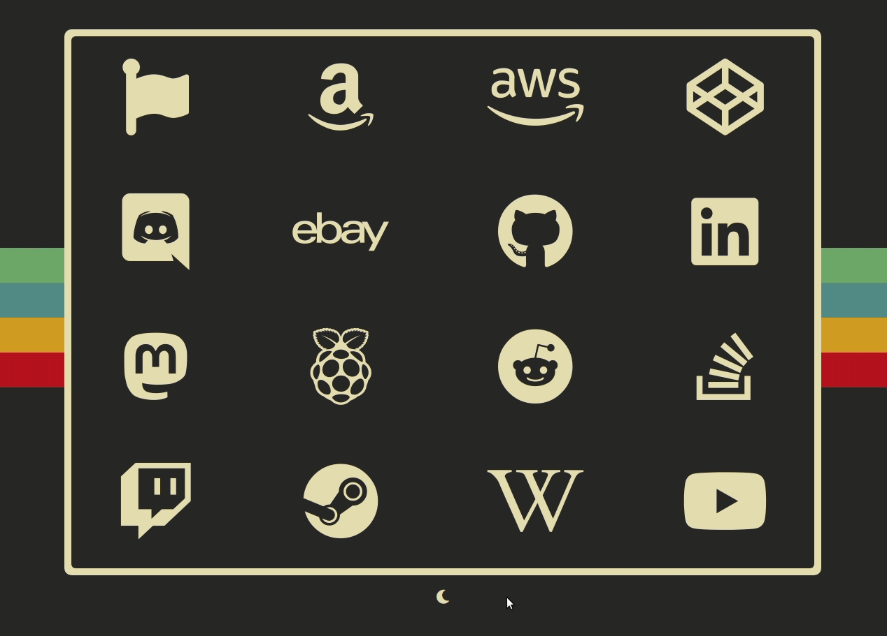

# My second start page

I was inspired to make this afterseeing [this post](https://www.reddit.com/r/wallpaper/comments/kevsd3/1920x1080_all_resolutions_available_dark_light/) from r/wallpaper, which I understand was inspired by [this post](https://www.reddit.com/r/wallpaper/comments/glfs0o/i_made_a_late_1970s_inspired_linux_wallpaper/), and the color scheme came from the [gruvbox](https://github.com/morhetz/gruvbox) color pallete.

## Features:

- Light and Dark mode
- Hover tranform effect
